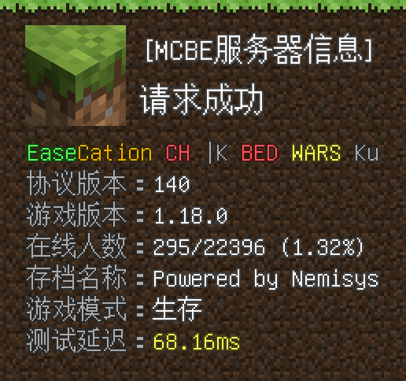
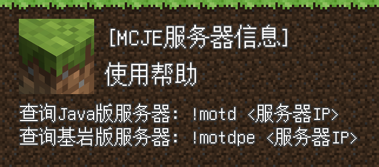

<!-- markdownlint-disable MD033 MD036 MD041 -->

  
   
  

# NoneBot-Plugin-PicMCStat

_✨ Minecraft 服务器 MOTD 查询 图片版 ✨_

## 📖 介绍

插件实际上是可以展示 **玩家列表**、**Mod 端信息 以及 Mod 列表（还未测试）** 的，这里没有找到合适的例子所以没在效果图里展示出来，如果遇到问题可以发 issue

插件包体内并没有自带图片内 Unifont 字体，需要的话请参考 [这里](#字体) 安装字体

因为下划线、删除线和斜体 [`nonebot-plugin-imageutils`](https://github.com/noneplugin/nonebot-plugin-imageutils) 的 bbcode 还不支持，所以还没做  
（如果 wq 佬看到这个能不能酌情考虑一下呢 awa）

效果图

  

## 💿 安装

### 插件

[推荐] 使用 nb-cli 安装

在 nonebot2 项目的根目录下打开命令行, 输入以下指令即可安装

    nb plugin install nonebot-plugin-picmcstat

使用包管理器安装

在 nonebot2 项目的插件目录下, 打开命令行, 根据你使用的包管理器, 输入相应的安装命令

pip

    pip install nonebot-plugin-picmcstat

pdm

    pdm add nonebot-plugin-picmcstat

poetry

    poetry add nonebot-plugin-picmcstat

conda

    conda install nonebot-plugin-picmcstat

打开 nonebot2 项目的 `bot.py` 文件, 在其中写入

    nonebot.load_plugin('nonebot_plugin_picmcstat')

### 字体

字体文件请自行去自行去 [这里](http://ftp.gnu.org/gnu/unifont/unifont-15.0.01/unifont-15.0.01.ttf) 下载

有两种方式可以安装该字体

- 方式一：直接安装在系统中
- 方式二：放在 `nonebot-plugin-imageutils` 插件的字体文件目录中并将文件重命名为 `unifont` 即可使用，该插件配置可以参考 [这里](https://github.com/noneplugin/nonebot-plugin-imageutils#%E9%85%8D%E7%BD%AE%E5%AD%97%E4%BD%93)

## ⚙️ 配置

### `MCSTAT_SHORTCUTS` - 快捷指令列表

这个配置项能够帮助你简化一些查询指令

此配置项的类型是一个列表，里面的元素需要为一个特定结构的字典  
这个字典需要有三个元素

- `regex` - 用于匹配指令的正则，例如 `^查服$`  
  （注意，nb2 以 JSON 格式解析配置项，所以当你要在正则表达式里表示`\`时，你需要将其转义为`\\`）
- `host` - 要查询的服务器地址，格式为 `<IP>[:端口]`，  
  例如 `hypixel.net` 或 `example.com:1919`
- `type` - 要查询服务器的类型，`je` 表示 Java 版服，`be` 表示基岩版服

最终的配置项看起来是这样子的，当你发送 `查服` 时，机器人会把 EaseCation 服务器的状态发送出来

    MCSTAT_SHORTCUTS=[{"regex":"^查服$","host":"asia.easecation.net","type":"be"}]

## 🎉 使用

发送 `motd` 指令 查看使用指南

## 📞 联系

QQ：3076823485  
Telegram：[@lgc2333](https://t.me/lgc2333)  
吹水群：[1105946125](https://jq.qq.com/?_wv=1027&k=Z3n1MpEp)  
邮箱：<lgc2333@126.com>

## 💡 鸣谢

### [nonebot-plugin-imageutils](https://github.com/noneplugin/nonebot-plugin-imageutils)

- 超好用的 Pillow 辅助库，快去用 awa

## 💰 赞助

感谢大家的赞助！你们的赞助将是我继续创作的动力！

- [爱发电](https://afdian.net/@lgc2333)
- 

    
赞助二维码（点击展开）

  

  

## 📝 更新日志

### 0.2.4

- 修复玩家列表底下的多余空行

### 0.2.3

- 修复 JE 服务器 Motd 中粗体意外显示为蓝色的 bug

### 0.2.2

- 修复 motd 前后留的空去不干净的问题
- 优化玩家列表显示效果

### 0.2.1

- 修复当最大人数为 0 时出错的问题

### 0.2.0

- 加入快捷指令，详见配置项
- 修复某些 JE 服无法正确显示 Motd 的问题
-

### 0.1.1

- 将查 JE 服时的 `游戏延迟` 字样 改为 `测试延迟`
